# Инструкции по запуску

## Способ 1: Conda окружение

### Создание и активация окружения (нужна conda или )
```bash
git clone https://github.com/Zea-Zee/tbank-logo-detector.git
cd tbank-logo-detector

conda create -n tbank-detector python=3.10
conda activate tbank-detector
pip install -r requirements.txt
```

### Запуск приложения
```bash
python main.py
```

### Проверка работы
Откройте браузер: http://localhost:8000

## Способ 2: Готовый Docker образ

### Скачивание и запуск
```bash
docker pull qzeaq/tbank-detector:latest

docker run -d \
  --name tbank-detector \
  -p 8000:8000 \
  --restart unless-stopped \
  qzeaq/tbank-detector:latest
```
Для windows
```
docker run -d --name tbank-detector -p 8000:8000 --restart unless-stopped qzeaq/tbank-detector:latest
```

### Проверка работы
Откройте браузер: http://localhost:8000

## Способ 3: Сборка Docker образа

### Подготовка
### Сборка и запуск
```bash
git clone https://github.com/Zea-Zee/tbank-logo-detector.git
cd tbank-logo-detector

docker build -t tbank-detector .

docker run -d \
  --name tbank-detector \
  -p 8000:8000 \
  --restart unless-stopped \
  -v "$(pwd)/models:/app/models" \
  tbank-detector
```

Для windows
```
docker run -d --name tbank-detector -p 8000:8000 --restart unless-stopped -v "$(pwd)/models:/app/models" tbank-detector
```

### Проверка работы
Откройте браузер: http://localhost:8000

## Использование API

### Через фронтенд
1. Откройте http://localhost:8000
2. Загрузите изображение через веб-интерфейс
3. Получите результат с визуализацией


### Через API напрямую
```bash
curl -X POST "http://localhost:8000/detect" \
  -H "Content-Type: multipart/form-data" \
  -F "file=@your_image.jpg"
```

### Ответ API
```json
{
  "detections": [
    {
      "bbox": {
        "x_min": 100,
        "y_min": 50,
        "x_max": 200,
        "y_max": 150
      }
    }
  ]
}
```

### Через python скрипт:
```
pip install requests
```
```
python test/test_detect.py
```

# Архитектура пайплайна

##### Бэкенд
FastAPI сервер с тремя основными эндпоинтами:
- `/detect` - детекция логотипа на изображении, возвращает только координаты
- `/detect-image` - детекция с визуализацией для фронтенда
- `/detect-video` - детекция на видео с визуализацией

Детектор использует YOLOv11s модель, обученную на 2000 изображениях с mAP50: 0.926. Модель загружается при старте сервера и работает с порогом уверенности 0.5.

##### Фронтенд
Навайбкодил простой HTML интерфейс с двумя страницами:
- `/` - загрузка и обработка изображений
- `/video` - загрузка и обработка видео

Фронтенд отправляет файлы через FormData на соответствующие эндпоинты и отображает результаты с визуализацией найденных логотипов.

##### Обработка файлов
Все файлы обрабатываются через временные файлы. YOLO сохраняет результаты в папку `temp/`, откуда они отдаются фронтенду. Временные файлы автоматически удаляются после обработки.


# Ретроперспектива решения

[Ноутбук ддя трейна](train.py)


### Первый этап - пробы
Увидев задачу я сразу подумал, что нужно использовать YOLO, поскольку это по прежнему SOTA решениt для задач детекции в большинстве доменов. Встала проблема - 30_000 неразмеченных изображений, большая часть из которых - негативные примеры. Изначально я решил сам собрать 100 изображений с яндекс и google картинок (причем фотографий типа фото из офиса, фото банкомата, скриншоты с видео из офиса Т Банка), быстро разметить, обучить v11n модель, предсказать с очень низким confidence часть датасета организаторов и посмотреть, какие положительные примеры они дали. Так прошло несколько итераций:
1. Я обучал модель
2. Делал предсказания по датасету, пока не наберется 200 изображений с боксами с confidence < 0.4
3. Эти изображения добавлял в трейн датасет, если там были лого Т Банка - размечал, иначе просто добавлял как негативный пример (так по 80% негативных примеров получалось).
Так прошло несколько итераций, и вроде по результатам предсказаний модель работала неплохо (на метрики я не сильно смотрел, поскольку датасет был еще мал и валидационная выборка была нужна только для защиты от оверфиттинга).

Так я довел датасет до > 600 картинок
На финальной валидационной выборке метрика вышла: 17 mAP50: 0.682 mAP50-95: 0.512


### Второй этап - бесплатная разметка
До сих пор я занимался баловством без нормального анализа датасета, но для начала я решил кратно увеличить количество размеченных положительных примеров, для этого я пошел на Roboflow universe и начал искать датасеты с названием / классами t bank, т банк, tinkoff и тд, так я нашел 10 датасетов, отсмотрел их и лишь в двух увидел достойное качество разметки (при этом изображения там были примитивные из датасета организаторов, то есть просто скрины сайта, приложения и тд), множество негативных примеров и положительные примеры, отличающиеся от того что у меня есть в разметке. Я провалидировал эту разметку, поправил где надо, сделал новую версию датасета, закинул обучение и пошел заниматься более серьезным делом.

Так я довел датасет до > 1100 картинок
На финальной валидационной выборке метрика вышла: mAP50: 0.775, mAP50-95: 0.617

### Третий этап - анализ датасета организаторов
Изначально предоставленный организаторами датасет вряд ли сильно полезен в исходном виде, поскольку там было очернь мало изображений с Т банком и они были однотипны. Нужно было посмотреть на все группы изображений из этого датасета, так я и решил сделать, для этого необходимо было сделать кластеризацию.
В качестве эмбеддера использовал CLIP (ViT-B/32)
Далее через PCA сжал размерность до 50 осей
И с помощью HDBSCAN разделил на кластеры.
Получились идеально семантически разделенные кластера (~50шт), и несколько кластеров было с логотипом Т банка, Картинка с примерами кластеров:

[Примеры кластеров](media/cluster_samples.png)

[Ноутбук для разделения на кластеры](clustering.ipynb)

Оттуда я руками отобрал "хорошие" (более-менее сложные, не просто скриншот, где лого ортогонально камере) и относительно уникальные (не набирал 20 одинаковых картинок Т Банк бизнес), а с каждого кластера без Т Банка взял по 3 изображения в валидацию и 7 изображений для негативных примеров (помним, что в датасете было уже более 600 негативных примеров).

Также у модели были проблемы с ложными предсказаниями, например на логотип Касперского с щитом, для этого я руками надобавлял негативных примеров с щитами (логотипы kaspersky, adguard, porcshe, ferrari, lamborgini и тд), также у модели были проблемы с тем, что она детектила букву T (так что я также добавил негативных прмиеров с буквой Т, например, логотип MS Teams).

Визуально качество снова выросло.
Так я довел датасет до > 1100 картинок
На финальной валидационной выборке метрики вышли: mAP50: 0.825, mAP50-95: 0.681


##### Четвертый этап - Опять улучшаем датасет
Все еще в датасете было достаточно мало "сложных" реальных примеров, а не просто однообразных скриншотов, для этого я еще искал фотографии (ни в коем случае не скриншоты), начал фотографировать логотипы в приложении Т банка у друзей, банкоматы Т банка на улице, также пошел на страницу продажи мерча Т банка и наскринил более 100 изображений (достаточно сложные примеры: вышитые логотипы, маленькие, под большим углом (перспективой)).

После всего этого в итоговом датасете получилось 2000 изображений, из которых с логотипом Т банка 800 и сложных из которых порядка 350.
На финальной валидационной выборке метрики вышли: mAP50: 0.926, mAP50-95: 0.808.

[Ноутбук для валидации и предикта](val.ipynb)

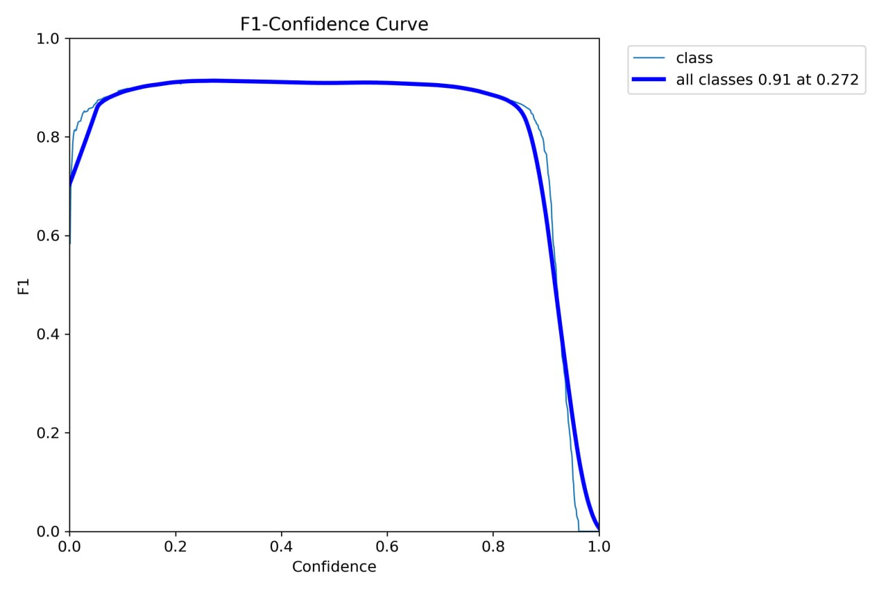

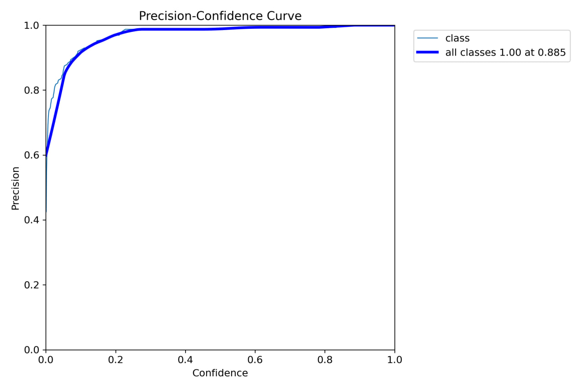

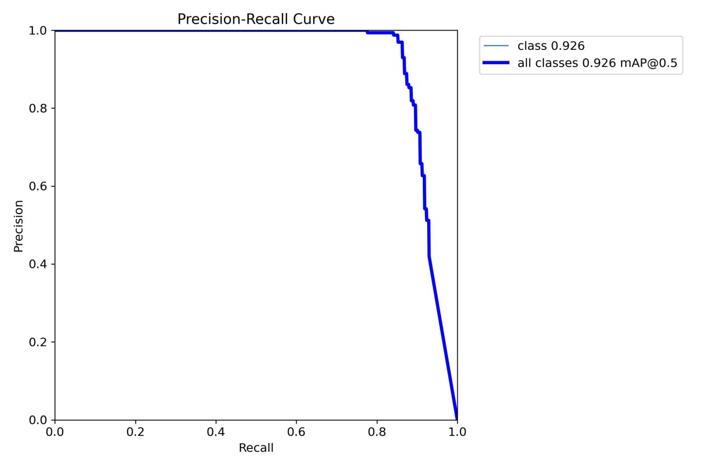

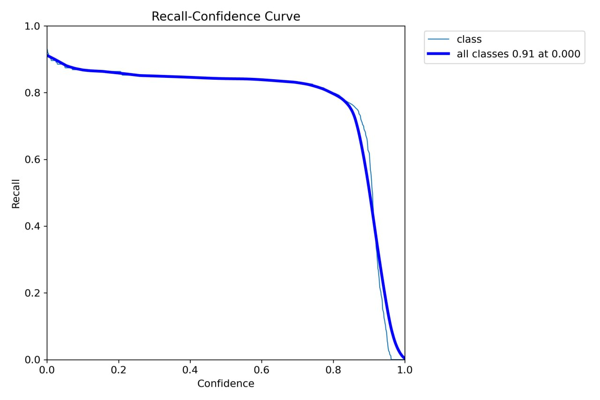

Из метрик видно, что оптимальным порогом уверенности будет 0.35.

На простой валидационной выборке (рандомные фотки с датасета организаторов, фотки с гугл картинок с банкоматами и тд (без маленьких лого и сильно искаженных, вообще это датасет с первого шага)): mAP50: 0.974, mAP50-95: 0.875.


## Примеры предсказаний (Зеленый бокс Ground Truth и Синий - предсказание финальной модели):
### Базовые примеры, где модель справляется
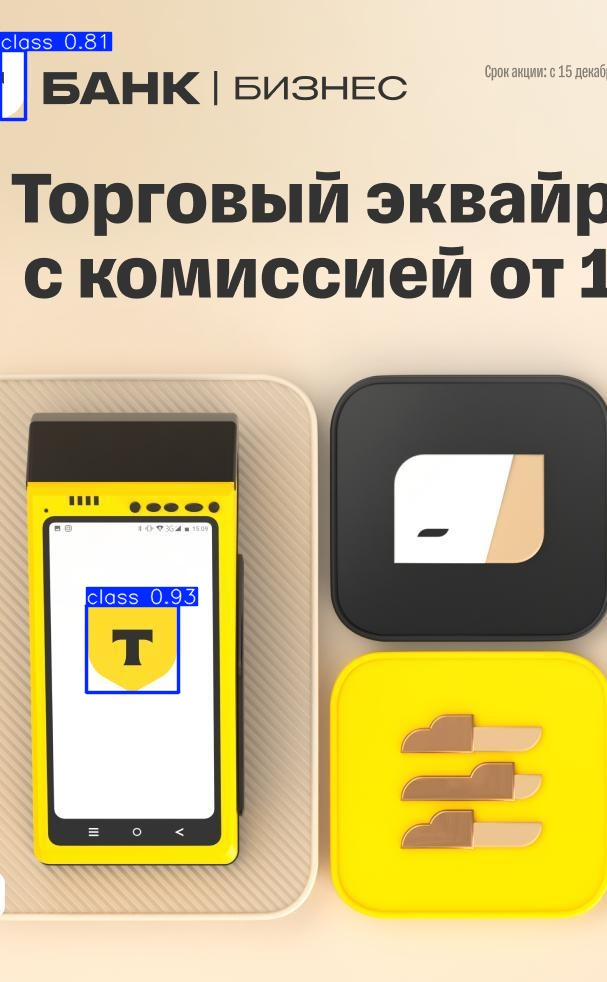
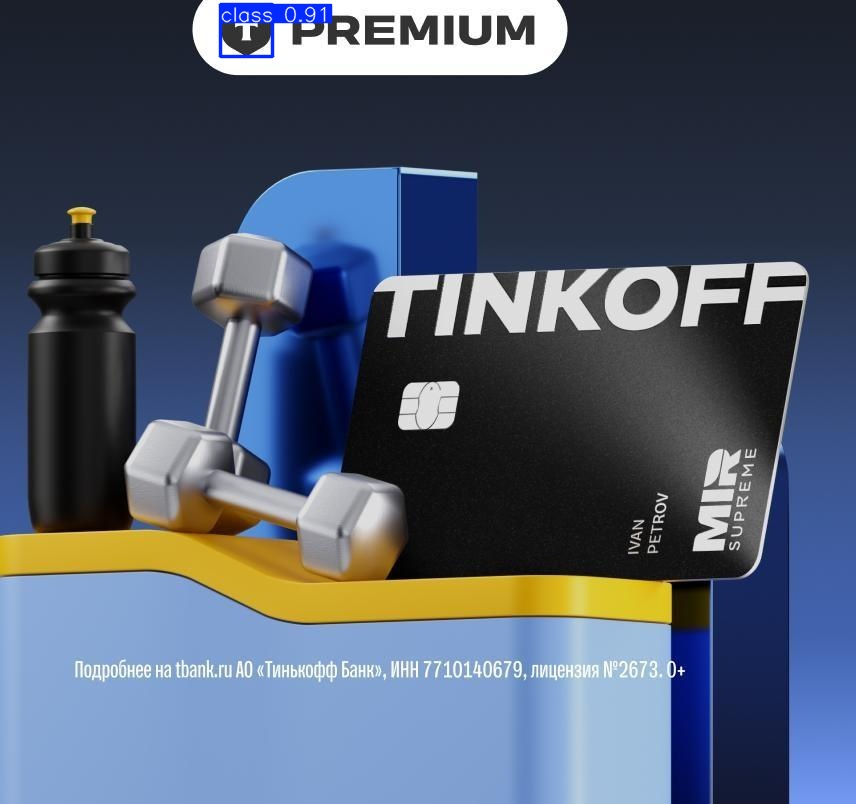


### Средние примеры, где модель справляется
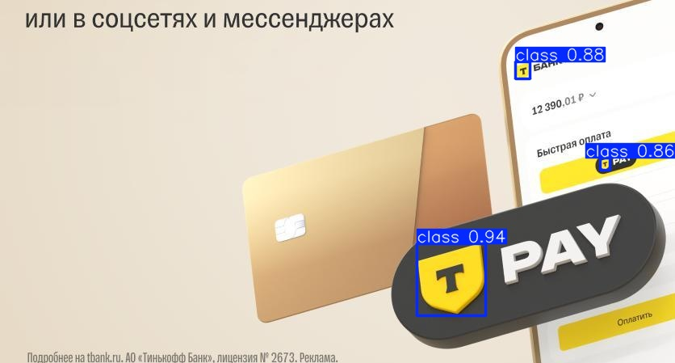
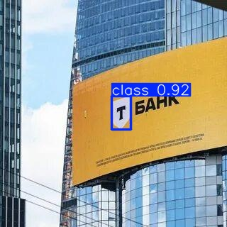


### Сложные примеры, где модель справляется
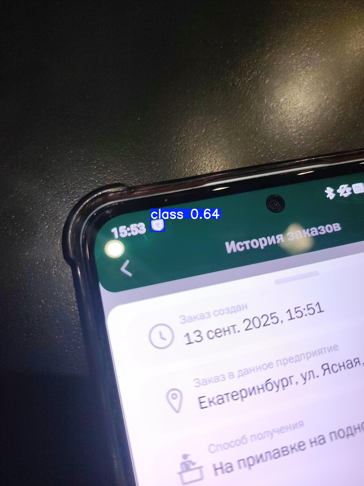
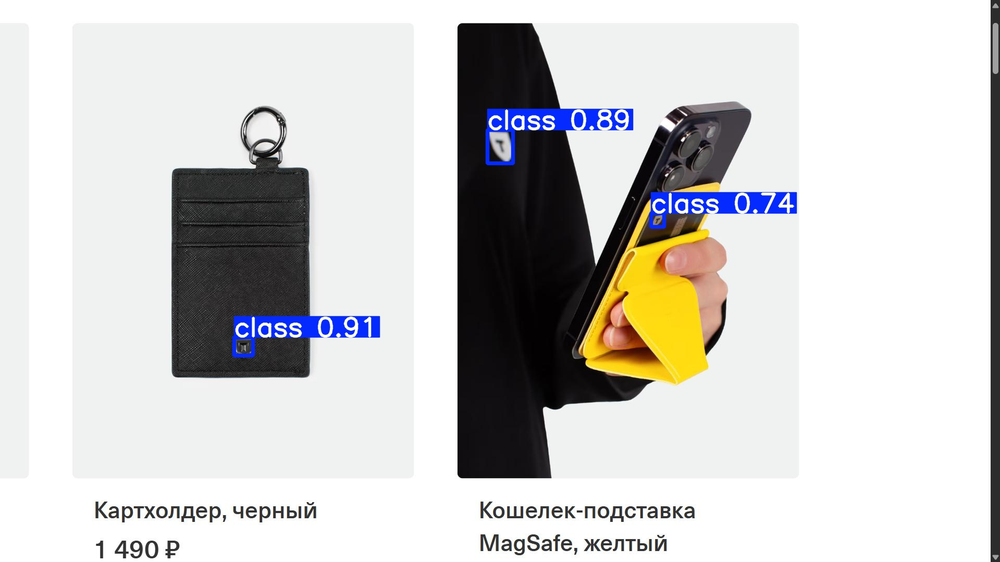
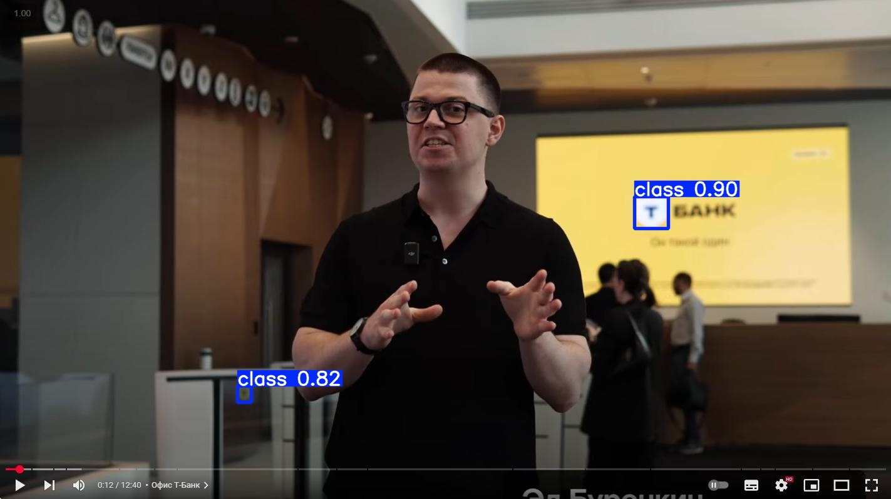


### Сложные примеры, где модель не справляется
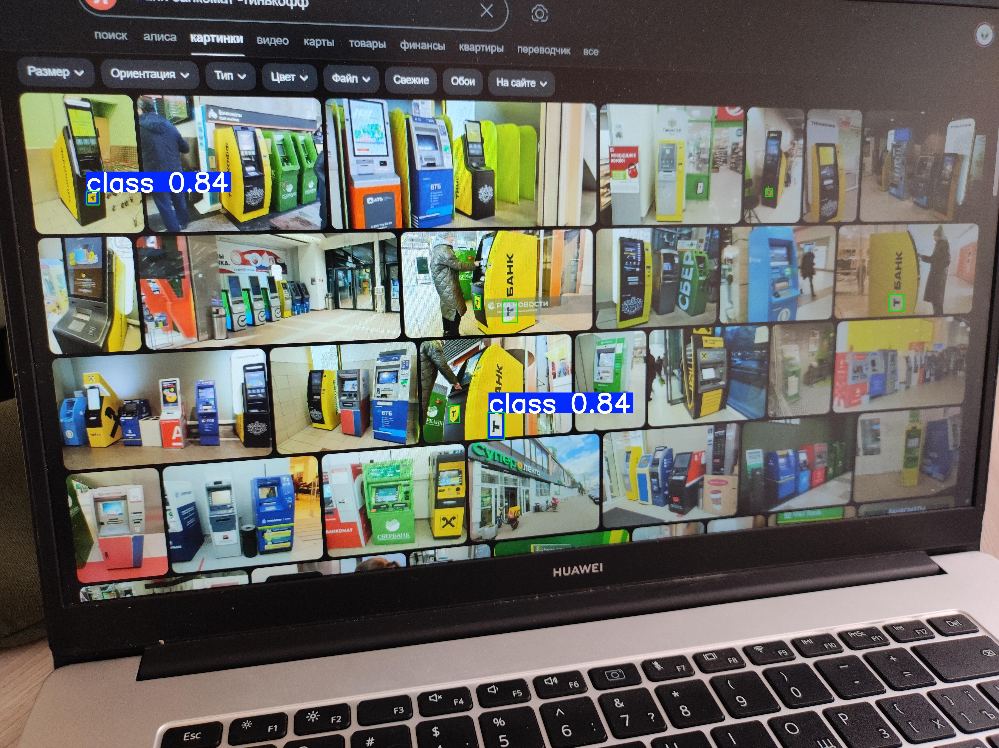
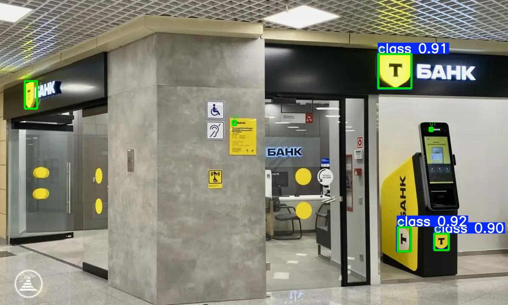
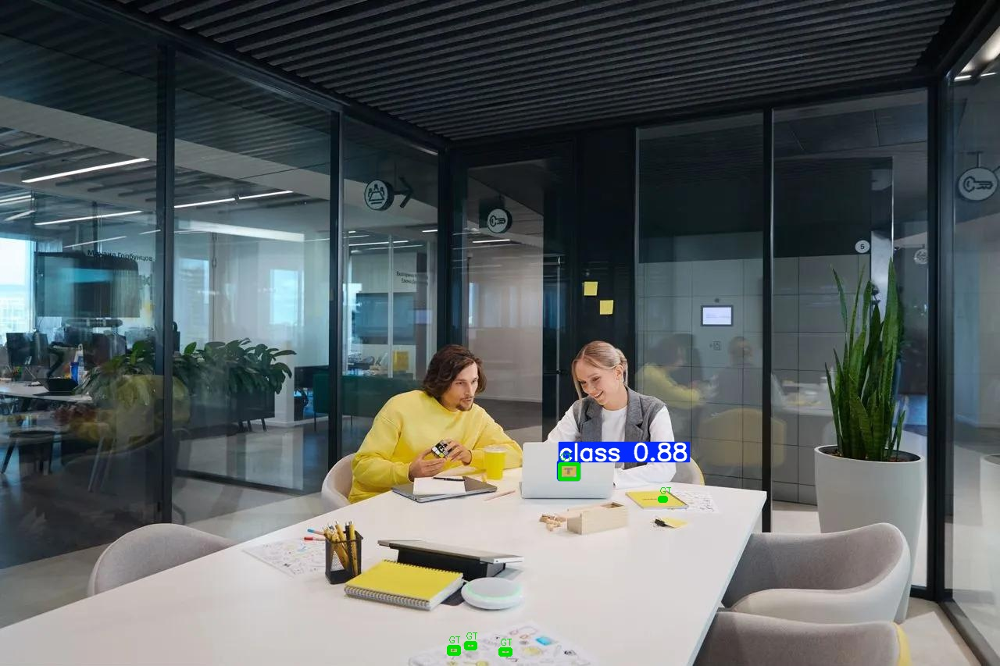
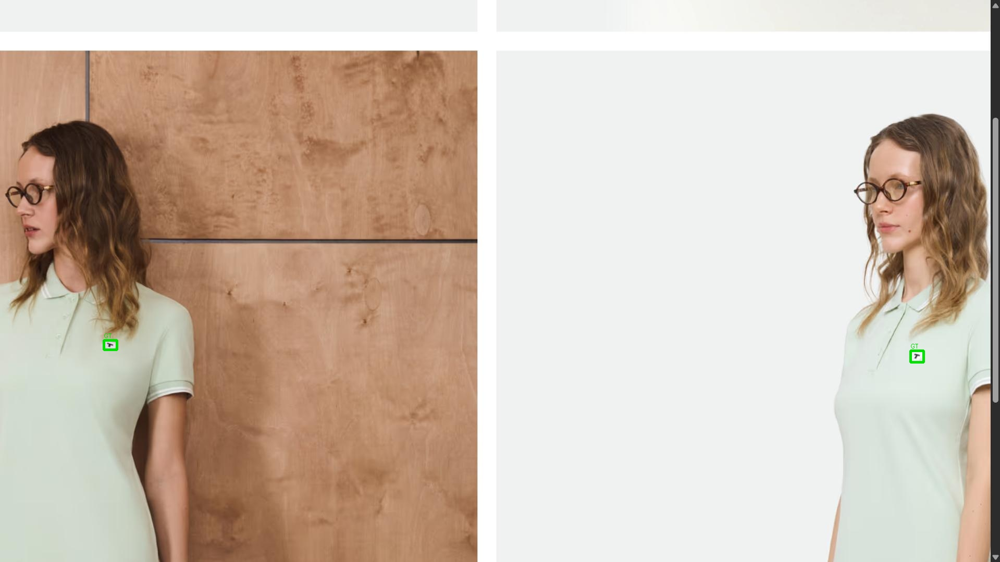


## Что стоит сделать для улучшения результатов:
### Сбор датасета:
1. В первую очередь необходимо сильно увеличить датасет (сейчас в датасете организаторов только скрншоты с сайта и с некоторой рекламы), нужно:
    1. Если делать это с доступом к ресурсам Т банка, то необходимо брать весь UI с логотипами Т банка.
    2. Также необходимы данные с реального мира (фотографии), например, фото офиса, фото банкоматов всех установленных, фото всего мерча, фото с различных мероприятий Т банка (митамы, лекции, корпоративы, реклама и тд), также фотографии например открытого приложения Т банка, Т мобайл, Т инвестиций и тд.
    3. Нужна синтетика (наделать 3D модели логотипов всех возможных цветов, под всевозможными углами наделать фото сцены), возможно в реалистичном симуляторе, по типу nvidia isaac еще понатягивать логотипы на здания, машины и тд.

    Таким образом оценить размер целевого датасета можно условно в 30_000 изображений с положительными примерами, а также изображения с негативными примерыми с этой же среды.
2. Вмешательство в архитектуру YOLO (как бейзлайн это неплохое решение, но нужно работать с выходными головами для того чтобы детектить маленькие логотпы (например 8x8 пикселей)), это в целом распространенная проблема YOLO, что она предобучена и часто используется для детекции больших объектов, которые занимают по 5 - 25% изображения.
3. Третий очевидный шаг - это проводить эксперименты на подбор эффективных гиперпараметров.

    ### Скорость инференса:
    Можно применить стандартный техники оптимизации DL моделей, например, такие как дистилляция (обучить 11x и передавать ее предикты как разметку для обучения nano / small модели).
    Также модель можно запрунить с помощью существующих фреймворков.
    Таким образом можно будет, например, получить очень точную и очень быструю small модель, которую можно будет встраивать на мобильные устройства даже без NPU.
